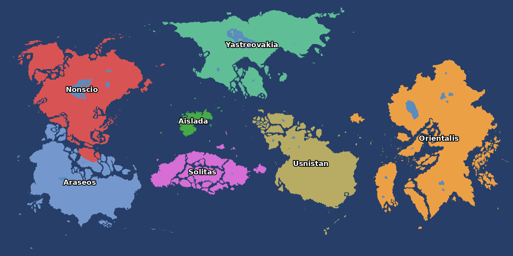

# Valsora — Hearts of Iron IV map

The Valsora world as a HOI4 1.19 map at 5120×2560, the largest size HOI4 allows.
Antarctica is gone, and the other continents are slightly larger and further apart.
Provinces are placeholder squares, with one placeholder country per continent.

## Install

1. In `Documents/Paradox Interactive/Hearts of Iron IV/mod/`, delete any old
   `valsora_test` folder and `valsora_test.mod`.
2. Unzip [`dist/valsora_test.zip`](dist/valsora_test.zip) into that `mod` folder. It
   contains both the folder and the `.mod` file.
3. Enable **Valsora (test map)** in the launcher and start the game with `-debug`, so
   map errors are logged instead of crashing.

## Files for drawing

- `dist/valsora_land_5120x2560.png`: land, sea and lakes exactly as in the game.
- `dist/valsora_countries_5120x2560.png`: the same map with the country colours from the
  `.pdn` moved onto the new layout. Draw country borders on this.
- `dist/preview_provinces.png`: the placeholder provinces.

## Rebuild

`sh scripts/run_all.sh` (Python 3 with numpy, scipy, pillow, scikit-image). See
`CLAUDE.md` for how the pipeline works and which HOI4 rules it enforces.
